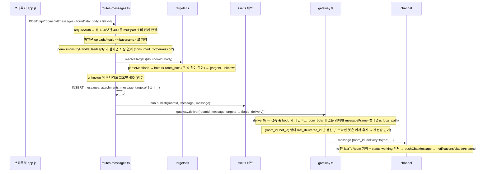
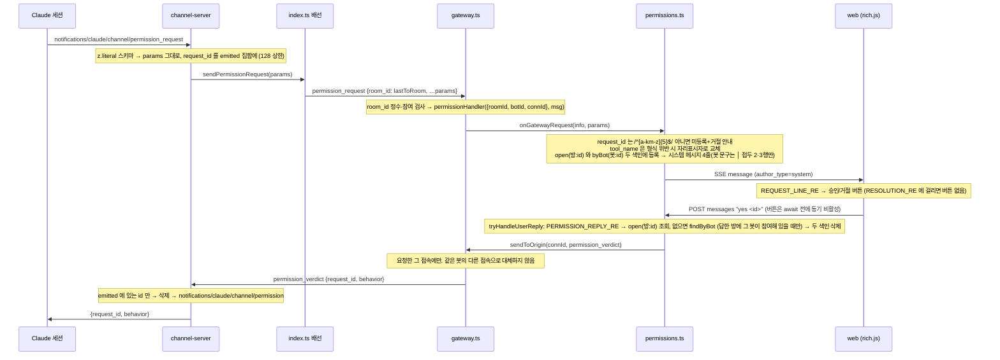

# minidiscord 코드맵 — 핵심 흐름과 데이터 모델

> 기준 커밋 `74ff7c9` (WT-v2-model, 2026-09-07). 생성 방법: 소스 전수 판독. 각 흐름은 파일과 함수 이름으로 앵커를 잡았다.
>
> 다른 코드맵: [overview.md](./overview.md) (전체 개요) · [modules.md](./modules.md) (모듈 카탈로그) · [dependencies.md](./dependencies.md) (의존 그래프) · [entry-points.md](./entry-points.md) (진입점·API·프로토콜)

## 1. 데이터 모델 (`server/src/db.ts`)

SQLite 파일 하나(`MINIDISCORD_DATA_DIR/minidiscord.db`, `journal_mode = WAL`). 테이블 8개, 인덱스 2개 (SPEC-BOTMODEL-001 §3.1).

| 테이블 | 열 | 비고 |
|---|---|---|
| `users` | `id`, `username` UNIQUE, `created_at` | 열 셋 — 비밀번호 없음. 로그인 때 `INSERT OR IGNORE` 로 생성 |
| `sessions` | `token` PK, `user_id` → users, `created_at` | `md_session` 쿠키 값 |
| `rooms` | `id`, `name`, `status` (`active`/`archived`), `created_at`, `archived_at` | 구성원 표 없음 — 모든 사람이 모든 방을 본다 |
| `bots` | `id`, `name` UNIQUE, `description`, **`token`** UNIQUE, **`role`** (기본 `'worker'`), `created_at` | 봇 = 신원. 토큰은 평문으로 저장. `role` 은 등록 라우트가 `orchestrator`\|`worker` 로 검증하고 게이트웨이 역할 필터가 읽는다 |
| `room_bots` | `room_id` → rooms, `bot_id` → bots, **`last_delivered_id`** (기본 0), **PK (room_id, bot_id)** | 참여 = 행 하나. 재접속 재전송 커서가 참여 행에 산다 — 방마다 따로 |
| `messages` | `id`, `room_id`, `author_type` (`user`/`bot`/`system`), `author_user_id`, `author_bot_id`, `body`, `created_at` | 시스템 메시지(승인 요청·결과·미참여 거절·역할 거절·강등 안내)도 여기 |
| `message_targets` | `message_id`, `bot_id`, `delivery` (`to`/`cc`) | **PK 없음** — 같은 봇이 TO 와 CC 에 함께 있으면 두 행 (의도). 사람 글·봇 글 둘 다 여기 남긴다 |
| `attachments` | `id`, `message_id`, `filename`, `stored_path`, `size`, `mime` | 실제 파일은 `uploads/<uuid>-<basename>` |

인덱스: `idx_messages_room (room_id, id)`, `idx_targets_bot (bot_id, message_id)`.

`openDb` 는 마이그레이션을 하지 않는다. 대신 옛 파일을 **거절**한다 (둘 다 throw, 안내는 «개발용 DB 파일을 지우고 새로 만드세요»):

1. `PRAGMA table_info(bots)` 에 `token` 열이 없으면 v1(방별 토큰 시대) 파일이다.
2. `PRAGMA table_info(users)` 의 열 수가 3이 아니면 비밀번호 시대 파일이다.

### 커서 체계 하나로 셋을 처리한다

`messages.id` 는 전역 단조 증가다. 같은 번호를 세 곳이 쓴다.

| 쓰는 곳 | 저장 위치 | 뜻 |
|---|---|---|
| 재접속 재전송 | `room_bots.last_delivered_id` (방 × 봇마다) | 이 봇에게 그 방에서 마지막으로 **실제 전달한** 메시지 |
| `fetch_history` 의 `since_id` / 응답 `cursor` | 세션의 기억 | 이 번호 다음부터 |
| 웹 목록 `?after=` / SSE 재연결 백필 | 브라우저 `state.lastEventId` | 화면이 마지막으로 그린 메시지 |

## 2. 흐름 (a) — 사람이 `@TO`/`@CC` 메시지를 보내면 봇에게 닿기까지

멘션이 없는 메시지는 어느 봇에게도 가지 않는다 (`targets` 가 비면 `deliverTo` 가 아무것도 보내지 않음). 사람 경로에는 역할 필터도 연속 봇 글 상한도 없다 — 사람은 어느 참여 봇이든 `@TO` 할 수 있다.

## 3. 흐름 (b) — 봇 글이 브라우저에 뜨고, 다른 봇에게 닿기까지

1. 세션이 `reply` 도구 호출 → `channel-server.ts` → `deps.sendToChat({chat_id?, text, files?})`.
2. `channel/src/index.ts`: `roomOf(chat_id)` 로 방을 정한 뒤 `gw.send({type:'bot_message', room_id, body, files:[{local_path}]})` → `gw.send({type:'status', room_id, state:'idle'})`.
3. `gateway.ts handleWsMessage`: `room_id` 정수 검사 → `isMember(roomId, botId)` 검사. 둘 중 하나라도 어긋나면 프레임을 버린다 (행·발행·응답 없음, 소켓 유지).
4. `handleBotMessage`: `author_type='bot'` 으로 `messages` 삽입. 파일마다 `realpathSync(local_path)` 가 `realpathSync(botFilesDir) + sep` 로 시작할 때만 복사 (`resolve` 가 아니라 `realpathSync` 인 이유: `copyFileSync` 가 심볼릭 링크를 따라가므로). `botFilesDir` 미설정이면 전부 거부. `mime` 은 상수 `application/octet-stream`.
5. `hub.publish(roomId, 'message', {…row, author_name, attachments})` — `attachments` 는 `id, filename` 만, `stored_path` 는 절대 내보내지 않음.
6. **봇 → 봇 전달 (v2 B).** 같은 함수가 이어서 `resolveTargets(db, roomId, body)` 를 부른다. 봇 경로는 응답 프레임이 없으므로 거부·강등을 system 메시지 한 줄로 알린다 (원문은 이미 저장·발행됐다):
   - `unknown` 이 있으면 `«<이름> 봇은 이 방에 초대되지 않았습니다»` — 나머지 타깃은 계속 간다.
   - 발신 봇의 `bots.role` 이 `worker` 면 타깃 중 `role !== 'orchestrator'` 를 걸러내고 `«worker 봇은 <이름> 봇을 부를 수 없습니다»` 를 남긴다.
   - 남은 타깃에 `to` 가 있고 `botRunSinceLastHuman(roomId) >= BOT_RUN_LIMIT(6)` 이면 (마지막 사람 글 이후 봇 글 수, 지금 글 포함, system 글은 연속을 끊지 않음) 전부 `cc` 로 내리고 `«사람 글 없이 봇 글이 6개 이어져 @TO 를 cc 로 내렸습니다»` 를 남긴다.
   - 남은 타깃마다 `message_targets` 행을 쓰고 `deliverTo` 로 보낸다 — 사람 경로와 같은 자리다.
7. `sse.ts publish` 가 방의 모든 구독 `ServerResponse` 에 `event: message\ndata: …\n\n`.
8. `web/app.js openStream` 의 `EventSource` 리스너 → `renderMessage`, 스크롤, `state.lastEventId` 갱신. `status:idle` 은 `bot_status` 이벤트로 와서 「입력 중」 표시를 지운다.

`handleWsMessage` 는 참여 검사 뒤에 `bot_message`·`status` 에 한해 `rooms.status = 'active'` 를 본다(`isActiveRoom`, t43) — 보관된 방으로 온 봇 글은 행·발행·응답 없이 버려지고 소켓은 유지된다 (사람 경로는 409).

## 4. 흐름 (c) — 봇 재접속과 놓친 메시지

1. 소켓 close → `gateway-client.ts retry()`: `sleep(backoff)` → 정지 아니면 `backoff = min(backoff×2, 30000)` → `connect()`. `open` 시 1000 으로 리셋.
2. `open` 에서 `hello{token}` 을 다시 보낸다 — 핸드셰이크는 이 한 프레임이다.
3. `handleHello`: `bots.token` 조회 → `conns` 에 `{botId, connId: randomUUID()}` 등록 → `welcome{bot_id, bot_name, rooms}` (참여한 활성 방) → `replayMissed`.
4. 재전송 질의 한 번: `message_targets t JOIN messages m JOIN room_bots rb ON (rb.room_id = m.room_id AND rb.bot_id = t.bot_id) WHERE t.bot_id = ? AND m.id > rb.last_delivered_id ORDER BY m.id` — **이 봇이 타깃이었던** 메시지만, 방마다 다른 커서로, 참여가 끊긴 방은 JOIN 에서 빠진다.
5. 재전송이 끝난 뒤 방마다 마지막 id 로 `advanceCursor` 한 번씩.
6. 클라이언트는 `welcome` 을 콜백으로 넘기지 않는다. 이어 오는 `message` 프레임이 `onMessage` 로 가고, `to` 면 배선이 `lastToRoom` 을 갱신한다.

## 5. 흐름 (d) — 권한 요청 → 사람 판정 → 봇

`byBot` 둘째 색인은 v2 결정 ①의 안전망이다 — 채널이 `lastToRoom` 으로 근사한 방이 틀려도, 같은 봇이 참여한 다른 방에서 온 `yes` 가 같은 요청을 닫는다.

결과 안내는 셋이다 — 실패 둘(`⚠️ 요청한 세션의 신원이 기록되지 않아 …` · `⚠️ 요청한 세션이 끊겨 …`)은 꼬리 `전달하지 못했습니다 (<id>)` 를 반드시 유지하고, 성공은 `✅ 승인 전송됨 (<id>)` 또는 `⛔ 거절 전송됨 (<id>)` 다. `web/rich.js` `RESOLUTION_RE` 가 이 세 꼬리로 버튼을 잠근다 (코드에 `[HARD]`).

## 6. 흐름 (e) — `fetch_history` 와 `since_id`

1. 도구 호출 → `deps.fetchHistory({chat_id?, …})`.
2. `channel/src/index.ts`: `roomOf(chat_id)` → `gw.requestHistory({room_id, …rest})`.
3. `gateway-client.ts requestHistory`: `rid = randomUUID()`, 10초 타이머, `{type:'history_request', rid, room_id, …}`. 소켓이 OPEN 이 아니면 타이머·맵 잔여 없이 즉시 reject.
4. `gateway.ts handleWsMessage` 의 `room_id`·참여 검사 → `handleHistory`: `limit = min(limit ?? 100, 500)`. **최신 N 개를 먼저 자르고** (`ORDER BY id DESC LIMIT`) 뒤집은 다음 `speaker → since_id → since → until` 순으로 거른다. 응답 `{type:'history_response', room_id, rid, messages:[{id, author_name, body, created_at}]}` 은 요청한 소켓 하나에만.
5. 클라이언트가 `rid` 로 promise 를 푼다.
6. `channel/src/index.ts`: `{id, at, author, body}` 로 매핑, `author`/`body` 만 중화·절단(`id`/`at` 는 손대지 않음 — `id` 가 커서의 유일 출처), 직렬화 문서가 16,000 바이트에 들 때까지 **가장 큰 id 부터** 버린다. `cursor = 남은 것 중 max(id)`, 비면 `null`.

가장 오래된 것이 아니라 최신부터 버리는 이유: 버린 메시지를 커서가 「이미 봤다」고 선언하지 않게 하려는 불변식이다.

## 7. 흐름 (f) — 방 보관

1. `POST /api/rooms/:id/archive` — `requireAuth` 만.
2. 정수 아닌 id 는 404.
3. 한 트랜잭션: `SELECT status` → `missing`/`conflict`/`ok`. `ok` 일 때만 `UPDATE rooms SET status='archived', archived_at`. 철회할 방별 토큰이 없으므로 UPDATE 는 이것 하나다.
4. `missing` → 404, `conflict` → 409 (본문 구분).
5. **커밋 뒤에** `opts.onArchive(id)` — `index.ts` 가 `gateway.closeRoom(roomId)` 에 묶지만 v2 의 `closeRoom` 은 **빈 몸체**다. 접속이 봇 단위라 방을 보관해도 닫을 소켓이 없다.
6. 보관의 효과는 넷이다: 사람 전송 409 (`routes-messages.ts`), 참여 추가 409 (`routes-bots.ts`), 다음 `welcome` 의 `rooms` 에서 빠짐 (`handleHello` 의 `r.status = 'active'`), 봇의 `bot_message`·`status` 조용히 버림 (`handleWsMessage` 의 `isActiveRoom`, t43). `room_bots` 행은 남으므로 `history_request` 는 계속 답한다 — 보관은 읽기 전용이다. E2E 15단계가 «접속 유지·welcome 에서 빠짐·사람 전송 409·봇 글 미저장» 을, `gateway.test.ts` t43 이 봇 글·상태 버림과 이력 응답을 단언한다.

## 8. 흐름 (g) — 봇 등록과 참여

1. `POST /api/bots {name, description?, role?}` — `role` 은 `orchestrator`|`worker` 만 (비우면 `worker`). 웹 폼은 `role` 을 보내지 않으므로 웹에서 등록한 봇은 전부 `worker` 다 (`web/app.js createBot`).
2. `randomBytes(32).toString('hex')` 토큰을 `bots.token` 에 **평문으로** 저장하고 응답 `{id, name, token, command}` 에 **한 번만** 싣는다. 이후 어떤 조회 응답(`GET /api/bots`, 참여 목록)에도 토큰은 없다. `command` 는 `claude mcp add …` + `export MINIDISCORD_TOKEN/SERVER` + `claude --dangerously-load-development-channels …` 세 토막이며, 웹의 봇 다이얼로그가 `명령 복사` 버튼과 함께 보여 주고 닫힐 때 DOM 에서 지운다.
3. `POST /api/rooms/:id/bots {bot_id}` — `INSERT OR IGNORE INTO room_bots`. 토큰은 오가지 않는다. 같은 봇을 여러 방에 참여시켜도 접속은 하나이고, `welcome.rooms` 와 프레임의 `room_id` 가 방을 가른다.
4. `DELETE /api/rooms/:id/bots/:botId` — 그 방의 참여 행만 지운다. 커서(`last_delivered_id`)도 함께 사라지므로 다시 참여시키면 0 부터 시작한다 — 즉 그 방의 이 봇 타깃 메시지 전부가 다음 `hello` 때 재전송된다.
