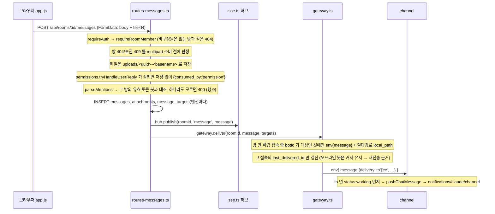
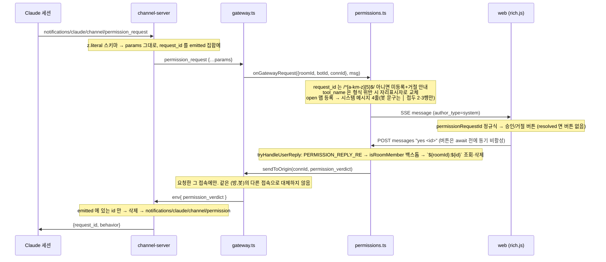

# minidiscord 코드맵 — 핵심 흐름과 데이터 모델

> 기준 커밋 `6418b31` (2026-09-07). 각 흐름은 파일과 함수 이름으로 앵커를 잡았다.

## 1. 데이터 모델 (`server/src/db.ts`)

SQLite 파일 하나(`MINIDISCORD_DATA_DIR/minidiscord.db`, `journal_mode = WAL`). 테이블 10개.

| 테이블 | 열 | 비고 |
|---|---|---|
| `users` | `id`, `username` UNIQUE, `password_hash`, `created_at` | scrypt 해시 |
| `sessions` | `token` PK, `user_id` → users, `created_at` | `md_session` 쿠키 값 |
| `rooms` | `id`, `name`, `status` (`active`/`archived`), `created_at`, `archived_at`, `created_by` → users | `created_by` 는 ALTER 로 추가된 **기록용** 열. 인가는 `room_members` 만 본다 |
| `bots` | `id`, `name` UNIQUE, `description`, `created_at` | 페르소나 없음 |
| `bot_tokens` | `id`, `room_id`, `bot_id`, **`verifier_pub`** UNIQUE (Ed25519 공개키 hex), **`server_confirm_key`**, `last_delivered_id` (기본 0), `last_seen_at`, `revoked_at`, `created_at` | 초대 1건 = 1행. 평문 토큰은 저장하지 않는다 |
| `messages` | `id`, `room_id`, `author_type` (`user`/`bot`/`system`), `author_user_id`, `author_bot_id`, `body`, `created_at` | 시스템 메시지(승인 요청·결과)도 여기 |
| `message_targets` | `message_id`, `bot_id`, `delivery` (`to`/`cc`) | **PK 없음** — 같은 봇이 TO 와 CC 에 함께 있으면 두 행 (의도) |
| `attachments` | `id`, `message_id`, `filename`, `stored_path`, `size`, `mime` | 실제 파일은 `uploads/<uuid>-<basename>` |
| `room_members` | `room_id`, `user_id`, `created_at`, **PK (room_id, user_id)** | 복합 PK 가 동시 초대를 읽기-쓰기 없이 멱등하게 만든다 |
| `schema_migrations` | `name` PK, `applied_at` | 백필 표식 |

인덱스: `idx_messages_room (room_id, id)`, `idx_targets_bot (bot_id, message_id)`.

`openDb` 안의 마이그레이션 세 가지 (파일 기반이 아니라 명령형):

1. **v1 스키마 거부** — `bot_tokens` 에 `verifier_pub` 이 없으면 throw. v1 `token_hash` → v2 변환은 **없다** (서버가 평문을 가진 적이 없어 유도할 수 없음).
2. **`rooms.created_by` 추가** — `PRAGMA table_info` 확인 후 nullable ALTER (기존 행을 지어내지 않음).
3. **`roomauthz-001-backfill`** — 표식 행이 없으면 한 트랜잭션으로 `rooms × users` 전체를 `room_members` 에 넣고 표식을 쓴다. 표식 없이 `INSERT OR IGNORE` 만 쓰면 나중에 탈퇴 기능이 생겼을 때 나간 사람이 되살아난다.

### 커서 체계 하나로 셋을 처리한다

`messages.id` 는 방마다 단조 증가한다. 같은 번호를 세 곳이 쓴다.

| 쓰는 곳 | 저장 위치 | 뜻 |
|---|---|---|
| 재접속 복구 `missed_after_id` | `bot_tokens.last_delivered_id` (접속별로 갱신) | 이 봇에게 마지막으로 **실제 전달한** 메시지 |
| `fetch_history` 의 `since_id` / 응답 `cursor` | 세션의 기억 | 이 번호 다음부터 |
| 웹 목록 `?after=` / SSE `lastEventId` | 브라우저 `state` | 화면이 마지막으로 그린 메시지 |

## 2. 흐름 (a) — 사람이 `@TO`/`@CC` 메시지를 보내면 봇에게 닿기까지

멘션이 없는 메시지는 어느 봇에게도 가지 않는다 (`targets` 가 비면 `deliver` 가 아무것도 보내지 않음).

## 3. 흐름 (b) — 봇 응답이 브라우저에 뜨기까지

1. 세션이 `reply` 도구 호출 → `channel-server.ts` → `deps.sendToChat`.
2. `channel/src/index.ts`: `gw.send({type:'bot_message', body, files:[{local_path}]})` 뒤 `gw.send({type:'status', state:'idle'})`.
3. `gateway.ts handleBotMessage`: `author_type='bot'` 으로 `messages` 삽입. 파일마다 `realpathSync(local_path)` 가 `realpathSync(botFilesDir) + sep` 로 시작할 때만 복사 (`resolve` 가 아니라 `realpathSync` 인 이유: `copyFileSync` 가 심볼릭 링크를 따라가므로). `botFilesDir` 미설정이면 전부 거부.
4. `hub.publish(roomId, 'message', {…row, author_name, attachments})` — `attachments` 는 `id, filename` 만, `stored_path` 는 절대 내보내지 않음.
5. `sse.ts publish` 가 방의 모든 구독 `ServerResponse` 에 `event: message\ndata: …\n\n`.
6. `web/app.js openStream` 의 `EventSource` 리스너 → `renderMessage`, 스크롤, `state.lastEventId` 갱신. `status:idle` 은 `bot_status` 이벤트로 와서 「입력 중」 칩을 지운다.

## 4. 흐름 (c) — 봇 재접속과 놓친 메시지

1. 소켓 close → `gateway-client.ts retry()`: `sleep(backoff)` → 정지 아니면 `backoff = min(backoff×2, 30000)` → `connect()`. `open` 시 1000 으로 리셋.
2. 새 `client_nonce` 로 v2 핸드셰이크 전체를 다시 한다 (논스는 소켓 지역적 — 소켓 간 재생 불가).
3. `handleAuth` 의 `welcome` 이 `missed_after_id = bot_tokens.last_delivered_id` 를 싣는다.
4. 재전송 질의: `message_targets JOIN messages WHERE bot_id=? AND room_id=? AND id > ? ORDER BY id` — **이 봇이 대상이었던** 메시지만, 오름차순.
5. 재전송이 끝난 뒤 커서를 마지막 id 로 한 번 갱신.
6. 클라이언트는 첫 검증 봉투로 확립하고, 그것이 `welcome` 이면 `onWelcome`, 이후 `message` 봉투는 `onMessage`.

## 5. 흐름 (d) — 권한 요청 → 사람 판정 → 봇

결과 안내는 셋이다 — 실패 둘(`⚠️ 요청한 세션의 신원이 기록되지 않아 …` · `⚠️ 요청한 세션이 끊겨 …`)은 꼬리 `전달하지 못했습니다 (<id>)` 를 반드시 유지하고, 성공은 `✅ 승인 전송됨 (<id>)` 또는 `⛔ 거절 전송됨 (<id>)` 다. `web/rich.js` `RESOLUTION_RE` 가 이 세 꼬리로 버튼을 잠근다 (코드에 `[HARD]`).

## 6. 흐름 (e) — `fetch_history` 와 `since_id`

1. 도구 호출 → `deps.fetchHistory(args)`.
2. `gateway-client.ts requestHistory`: `rid = randomUUID()`, 10초 타이머, `{type:'history_request', rid, …params}`. 소켓이 OPEN 이 아니면 타이머·맵 잔여 없이 즉시 reject.
3. `gateway.ts handleHistory`: `limit = min(limit ?? 100, 500)`. **최신 N 개를 먼저 자르고** (`ORDER BY id DESC LIMIT`) 뒤집은 다음 `speaker → since_id → since → until` 순으로 거른다. 응답 `{type:'history_response', rid, messages:[{id, author_name, body, created_at}]}`.
4. 클라이언트가 `rid` 로 promise 를 푼다.
5. `channel/src/index.ts`: `{id, at, author, body}` 로 매핑, `author`/`body` 만 중화·절단(`id`/`at` 는 손대지 않음 — `id` 가 커서의 유일 출처), 직렬화 문서가 16,000 바이트에 들 때까지 **가장 큰 id 부터** 버린다. `cursor = 남은 것 중 max(id)`, 비면 `null`.

가장 오래된 것이 아니라 최신부터 버리는 이유: 버린 메시지를 커서가 「이미 봤다」고 선언하지 않게 하려는 불변식이다.

## 7. 흐름 (f) — 방 보관 → 토큰 철회 → 접속 끊김

1. `POST /api/rooms/:id/archive` — `requireAuth` 만 (구성원 검사 없음, t17).
2. 정수 아닌 id 는 404.
3. 한 트랜잭션: `SELECT status` → `missing`/`conflict`/`ok`. `ok` 일 때만 `UPDATE rooms SET status='archived', archived_at` 과 `UPDATE bot_tokens SET revoked_at WHERE room_id=? AND revoked_at IS NULL`. 실패 갈래는 UPDATE 를 실행하지 않는다.
4. `missing` → 404, `conflict` → 409 (본문 구분).
5. **커밋 뒤에** `opts.onArchive(id)` — 훅 예외가 커밋된 보관을 되돌릴 수 없도록.
6. `index.ts` 가 그 훅을 `gateway.closeRoom(roomId)` 에 묶는다: 방의 확립 접속 전부를 `dropConn` (맵에서 먼저 지우고 `ws.close()` — `isOnline` 이 낡은 true 를 내지 않음).
7. 재접속 불가: `handleHello` 의 SELECT 가 `revoked_at IS NULL AND r.status='active'` 를 요구하므로 응답 프레임 없이 드롭된다. E2E 15단계가 이를 단언한다.

## 8. 흐름 (g) — 봇 초대 (토큰 발급)

1. `POST /api/rooms/:id/invites {bot_id}` (구성원만).
2. 같은 (방, 봇) 의 이전 토큰을 철회한다 — **재초대는 이전 세션을 끊는다** (라이브 검증 회고에서 두 번 겪은 사고).
3. 새 평문 토큰 생성 → `deriveBotKeys(token)` 으로 `verifier_pub`·`server_confirm_key` 유도 → `bot_tokens` 삽입. 평문은 응답에 **한 번만** 실리고 서버에 남지 않는다.
4. 응답에 세션 실행 명령(`--dangerously-load-development-channels` 플래그, `MINIDISCORD_TOKEN`·`MINIDISCORD_SERVER` env) 이 포함되고, 웹의 초대 다이얼로그가 `명령 복사` 버튼으로 보여 준다.
