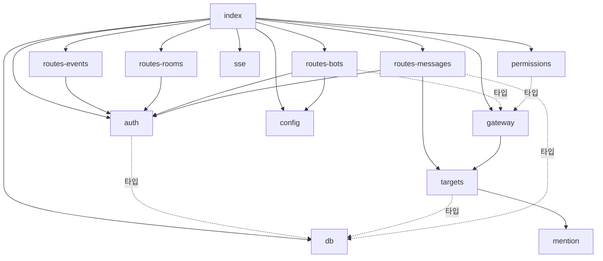
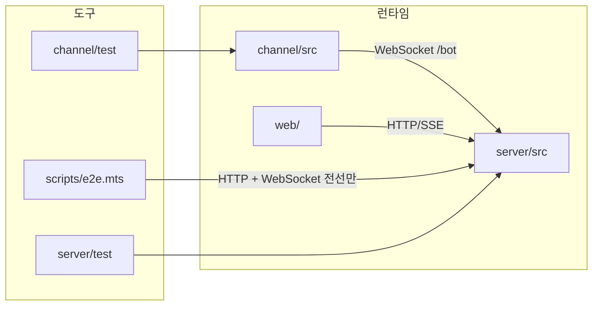

# minidiscord 코드맵 — 의존 그래프

> 기준 커밋 `74ff7c9` (WT-v2-model, 2026-09-07). 생성 방법: 내부 그래프는 `grep -nE "^import .* from ['\"]\.\.?/"` 로 뽑았고, 외부 의존은 `package.json` 이 아니라 **실제 import 문**(`grep -hoE "from '[^.][^']*'"`)을 기준으로 적었다.
>
> 다른 코드맵: [overview.md](./overview.md) (전체 개요) · [modules.md](./modules.md) (모듈 카탈로그) · [entry-points.md](./entry-points.md) (진입점·API·프로토콜) · [data-flow.md](./data-flow.md) (핵심 흐름·데이터 모델)

## 1. 서버 내부 그래프



인접 목록 (텍스트):

```
index.ts          -> db, auth, routes-rooms, routes-bots, routes-messages, routes-events, sse, gateway, permissions, config
auth.ts           -> db (타입)
config.ts         -> (없음)
db.ts             -> (없음)
mention.ts        -> (없음)   ← REQ-MENTION-006
sse.ts            -> (없음)
targets.ts        -> mention, db (타입)
routes-events.ts  -> auth
routes-rooms.ts   -> auth
routes-bots.ts    -> auth, config, gateway (타입)
routes-messages.ts-> auth, targets, db (타입)
gateway.ts        -> targets
permissions.ts    -> gateway (타입)
```

잎 모듈(내부 import 0): `config`, `db`, `mention`, `sse`. 이 넷은 단독으로 시험할 수 있다. `gateway.ts` 는 v2 B 단계에서 `targets.ts` 를 import 하게 되어 더는 잎이 아니다.

## 2. 채널 · 웹 · 스크립트 그래프

```
channel/src/index.ts          -> channel-server, gateway-client, truncate
channel/src/channel-server.ts -> truncate
channel/src/gateway-client.ts -> (없음)
channel/src/truncate.ts       -> (없음)

web/index.html  -> /app.js, /style.css
web/style.css   -> ./design-tokens.css (@import, 6행)
web/app.js      -> ./rich.js          ← 606행에서 import, 의도적 (SPEC-WEBRICH-001)
web/rich.js     -> (없음)

scripts/e2e.mts -> (내부 없음) node 내장 + ws (동적 import)
```

## 3. 워크스페이스 사이의 경계



- **런타임 세 컴포넌트 사이에 코드 import 는 없다.** 만나는 자리는 프로토콜뿐이다.
- `scripts/e2e.mts` 는 `server/src` 도 `server/test` 도 import 하지 않는다 (`grep -n "server/" scripts/e2e.mts` 는 주석 1건뿐). 실제 서버 프로세스를 spawn 하고 HTTP·WebSocket 으로만 말한다.
- `channel/test` 6 파일은 `channel/src` 넷만 import 한다 (`grep -rn "server/src" channel/` 0건). 서버 게이트웨이를 상대로 하는 채널 시험은 없다 — 두 끝의 프레임 계약은 `scripts/e2e.mts` 가 잰다.
- `server/test` 는 이제 공유 라이브러리가 아니다. 헬퍼 3 파일은 서버 시험만 쓴다.

## 4. 순환을 끊은 자리

모듈 수준 순환 import 는 없다. 순환이 생길 뻔한 곳을 이렇게 끊었다.

| 후보 순환 | 끊은 방법 |
|---|---|
| `routes-messages` ↔ `gateway` | routes-messages 는 `req.server.gateway` 데코레이터로만 게이트웨이를 부른다. `authorName` 을 import 하지 않고 `displayName` 을 **일부러 다시 구현**한다 (routes-messages.ts 161행 주석) |
| `permissions` ↔ `gateway` | permissions 는 `type ConnInfo` 만 import 하고, 회신은 `app.gateway.sendToOrigin` 데코레이터로 보낸다. 참여 검사(`findByBot`)는 `room_bots` 를 직접 조회한다 |
| `gateway` ↔ `routes-messages` (멘션 대조 공유) | 둘 다 `targets.ts` 를 import 한다 — 공유 조회를 아래로 내려 두 소비자가 서로를 모르게 했다. `gateway.deliver` 의 계약은 `{botId, delivery}` 뿐이라 routes-messages 가 `name`·`role` 을 벗겨 넘긴다 (routes-messages.ts 108행) |
| `channel/src/index.ts` 의 `wire()` | `gw` 콜백이 나중에 선언되는 `channel` 을 클로저로 잡는 TDZ 형태. 콜백은 `gw.start()` 뒤에만 불리므로 안전 (37행 주석) |

## 5. 외부 의존 (실제 import 기준)

### server

| 패키지 | 쓰는 곳 | 용도 |
|---|---|---|
| `fastify` ^5 | index, 라우트 전부·auth·permissions·gateway (타입) — 8 파일 | HTTP 프레임워크 |
| `@fastify/cookie` ^11 | index | `md_session` httpOnly 쿠키 (auth.ts 는 `req.cookies`·`reply.setCookie` 만 쓴다) |
| `@fastify/multipart` ^10 | index | `req.parts()` 스트리밍 업로드 — `registerMessageRoutes` **앞에** 등록해야 함 (REQ-MSG-015) |
| `@fastify/static` ^10 | index | `web/` 를 prefix `/` 로 서빙 — 와일드카드 GET 이 API 를 가리지 않도록 **맨 마지막**에 등록 |
| `better-sqlite3` ^13 | db | 동기 SQLite, prepared statement |
| `ws` ^8 | gateway | `WebSocketServer({server: app.server, path: '/bot'})` |
| node 내장 | `node:crypto`(randomBytes·randomUUID — 4 파일), `node:fs`(3), `node:path`(2), `node:http`(sse), `node:stream/promises`(routes-messages), `node:url`(index) | `node:tls` 는 더 쓰지 않는다 |
| dev: `vitest` ^4, `jsdom` ^29, `tsx`, `typescript` ^7, `@types/*` | | `@vitest/coverage-v8` 는 server 에 **없음** |

### channel

| 패키지 | 쓰는 곳 | 용도 |
|---|---|---|
| `@modelcontextprotocol/sdk` ^1 | channel-server (`Server`, `ListTools/CallToolRequestSchema`), index (`StdioServerTransport`) | MCP 서버 |
| `zod` ^4 | channel-server | `notifications/claude/channel/permission_request` 스키마 (`z.literal` 로 메서드명 고정 — 느슨하면 자기 알림을 되돌려 보냄) |
| `ws` ^8 | gateway-client | 클라이언트 소켓 |
| node 내장 | `node:crypto`(gateway-client, `randomUUID`), `node:url`(index) | |
| dev: `vitest` ^4, `@vitest/coverage-v8`, `tsx`, `typescript` ^7 | | `pretest` 가 `tsc` 실빌드 → `dist/index.js` |

### web

서드파티 0. 브라우저 API 만 쓴다: `fetch`, `EventSource`, `FormData`, `<dialog>.showModal`, `navigator.clipboard`.

### scripts / server/test 헬퍼

`scripts/e2e.mts`: node 내장(`child_process`, `fs`, `os`, `path`, `url`, `net`) + `ws`(동적 import). `wsupgrade-judgment.ts` 는 import 0 인 순수 모듈이고, `probe-db.ts`·`no-listen.ts` 는 `../src/db.js`·`../src/index.js` 만 import 한다.

## 6. 코드로 잡히지 않는 결합

import 그래프에는 안 보이지만 함께 바꿔야 하는 자리들이다.

| 결합 | 한쪽 | 다른 쪽 | 어긋나면 |
|---|---|---|---|
| 게이트웨이 프레임 `type` 집합과 필드명 (`hello`·`welcome`·`message`·`bot_message`·`status`·`history_request/response`·`permission_request/verdict`, `room_id`·`rid`·`local_path`) | `server/src/gateway.ts` `handleWsMessage`·`messageFrame` | `channel/src/gateway-client.ts`, `channel/src/index.ts`, `scripts/e2e.mts` | 알 수 없는 프레임은 양쪽 다 조용히 무시된다 — 시험이 아니라 E2E 만 잡는다 |
| 권한 시스템 메시지 문구 | `server/src/permissions.ts` (한국어 4줄 본문, `전달하지 못했습니다 (<id>)` 꼬리 `[HARD]`) | `web/rich.js` `REQUEST_LINE_RE` / `RESOLUTION_RE` 정규식 | 승인 버튼이 안 뜨거나 잠기지 않음 |
| 판정 답 형식 `yes <id>` / `no <id>` | `server/src/permissions.ts` `PERMISSION_REPLY_RE` (`/^\s*(y\|yes\|n\|no)\s+([a-km-z]{5})\s*$/i`) | `web/rich.js` `verdictBody` | 버튼이 보낸 답이 사용자 메시지로 저장되고 판정은 흐르지 않음 |
| 역할 값 `orchestrator` / `worker` | `server/src/routes-bots.ts` 등록 검증 | `targets.ts` 가 `role` 을 실어 오지만 `gateway.ts` 는 더 이상 읽지 않는다 (역할 필터 2026-09-08 삭제) | 지금은 어긋날 소비자가 없다 — 역할을 다시 읽는 코드를 넣으면 이 행을 되살릴 것 |
| `rich.js` 시그니처 | `web/rich.js` | `web/rich.d.ts` | 타입 검사는 통과하면서 런타임이 어긋남 (시험이 못 잡음) |
| SSE 이벤트 이름 `message`·`bot_status` | `server/src/sse.ts`·`gateway.ts`·`permissions.ts` (발행) | `web/app.js` `openStream` 리스너 | 화면이 조용히 멈춤 |
| 참여 목록 응답 `[{bot_id, bot_name, online}]`·등록 응답 `{id, name, token, command}` | `server/src/routes-bots.ts` | `web/app.js` `refreshRoomBots`, `web/rich.js` `applyInviteResult` | 칩·등록 명령 표시가 빈 채로 남음 |
| 알림 `meta` 여섯 키 (`chat_id`=방 번호, `message_id`, `delivery`, `sender`, `author_type`, `room_name`=방 이름 원문) | `channel/src/channel-server.ts` `pushChatMessage` | Claude Code 세션이 `reply`/`fetch_history` 의 `chat_id` 로 되돌림 | `chat_id` 가 비면 배선이 «마지막 to 방» 으로 채우고, 그것도 없으면 서버가 프레임을 버림 |
