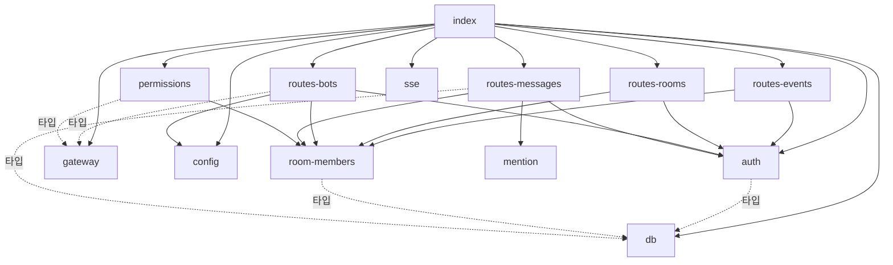

# minidiscord 코드맵 — 의존 그래프

> 기준 커밋 `6418b31` (2026-09-07). 내부 그래프는 `grep -nE "^import .* from ['\"]\.\.?/"` 로 뽑았고, 외부 의존은 `package.json` 이 아니라 **실제 import 문**을 기준으로 적었다.

## 1. 서버 내부 그래프



인접 목록 (텍스트):

```
index.ts          -> db, auth, routes-rooms, routes-bots, routes-messages, routes-events, sse, gateway, permissions, config
auth.ts           -> db (타입)
config.ts         -> (없음)
db.ts             -> (없음)
mention.ts        -> (없음)   ← REQ-MENTION-006
sse.ts            -> (없음)
room-members.ts   -> db (타입)
routes-events.ts  -> auth, room-members
routes-rooms.ts   -> auth, room-members
routes-bots.ts    -> auth, room-members, config, gateway (타입)
routes-messages.ts-> auth, room-members, mention, db (타입)
gateway.ts        -> (없음)   ← fastify·ws·node 내장만
permissions.ts    -> gateway (타입), room-members
```

잎 모듈(내부 import 0): `config`, `db`, `mention`, `sse`, `gateway`. 이 다섯은 단독으로 시험할 수 있다.

## 2. 채널 · 웹 · 스크립트 그래프

```
channel/src/index.ts          -> channel-server, gateway-client, truncate
channel/src/channel-server.ts -> truncate
channel/src/gateway-client.ts -> (없음)
channel/src/truncate.ts       -> (없음)

web/index.html  -> /app.js, /style.css
web/style.css   -> ./design-tokens.css (@import)
web/app.js      -> ./rich.js          ← 파일 맨 아래(633행 부근)에서 import, 의도적
web/rich.js     -> (없음)

scripts/e2e.mts          -> ../server/test/gateway-v2.ts (동적 import), ws (동적)
scripts/live-dryrun.mts  -> ./e2e.mts, ../server/test/live-extract-lib.ts, ../server/test/gateway-v2.ts (동적)
scripts/live-extract.mts -> ../server/test/live-extract-lib.ts
scripts/live-env.sh      -> (셸) server/, channel/dist/index.js, scripts/live-extract.mts 를 실행
```

## 3. 워크스페이스 사이의 경계

```mermaid
graph LR
  subgraph 런타임
    server[server/src]
    channel[channel/src]
    web[web/]
  end
  subgraph 도구
    scripts[scripts/]
    stest[server/test 헬퍼]
    ctest[channel/test]
  end
  channel -- WebSocket /bot --> server
  web -- HTTP/SSE --> server
  scripts --> stest
  ctest -.gateway-mutual-auth.test 만.-> server
  ctest --> channel
  stest -. 소스 import 없음 .-> server
```

- **런타임 세 컴포넌트 사이에 코드 import 는 없다.** 만나는 자리는 프로토콜뿐이다.
- `scripts/` → `server/test/` 는 한 방향 규칙(D1(a))으로 허용된다: 스크립트는 `server/src/**` 를 절대 import 하지 않는다. 결과적으로 `server/test/` 는 공유 라이브러리 역할을 겸한다.
- `channel/test/gateway-mutual-auth.test.ts` 만 `../../server/src/{db,sse,gateway,auth,routes-bots}.js` 를 가져와 **실제 서버 게이트웨이**를 상대로 클라이언트 핸드셰이크를 검증한다. 채널 소스는 서버 소스를 모른다.

## 4. 순환을 끊은 자리

모듈 수준 순환 import 는 없다. 순환이 생길 뻔한 곳 셋을 이렇게 끊었다.

| 후보 순환 | 끊은 방법 |
|---|---|
| `routes-messages` ↔ `gateway` | routes-messages 는 `req.server.gateway` 데코레이터로만 게이트웨이를 부른다. `authorName` 을 import 하지 않고 `displayName` 을 **일부러 다시 구현**한다 (routes-messages.ts 끝부분 주석) |
| `permissions` ↔ `gateway` | permissions 는 `type ConnInfo` 만 import 하고, 회신은 `app.gateway.sendToOrigin` 데코레이터로 보낸다 |
| `channel/src/index.ts` 의 `wire()` | `gw` 콜백이 나중에 선언되는 `channel` 을 클로저로 잡는 TDZ 형태. 콜백은 `gw.start()` 뒤에만 불리므로 안전 |

## 5. 외부 의존 (실제 import 기준)

### server

| 패키지 | 쓰는 곳 | 용도 |
|---|---|---|
| `fastify` ^5 | index, 라우트 전부(타입) | HTTP 프레임워크 |
| `@fastify/cookie` ^11 | index, auth | `md_session` httpOnly 쿠키 |
| `@fastify/multipart` ^10 | index, routes-messages | `req.parts()` 스트리밍 업로드 — `registerMessageRoutes` **앞에** 등록해야 함 (REQ-MSG-015) |
| `@fastify/static` ^10 | index | `web/` 를 prefix `/` 로 서빙 — 와일드카드 GET 이 API 를 가리지 않도록 **맨 마지막**에 등록 |
| `better-sqlite3` ^13 | db | 동기 SQLite, prepared statement |
| `ws` ^8 | gateway | `WebSocketServer({server: app.server, path: '/bot'})` |
| node 내장 | `node:crypto`(scrypt·HMAC·Ed25519·randomUUID), `node:fs`, `node:path`, `node:stream/promises`, `node:tls`(채널 바인딩), `node:http`, `node:url` | |
| dev: `vitest` ^4, `jsdom` ^29, `tsx`, `typescript` ^7, `@types/*` | | `@vitest/coverage-v8` 는 server 에 **없음** |

### channel

| 패키지 | 쓰는 곳 | 용도 |
|---|---|---|
| `@modelcontextprotocol/sdk` ^1 | channel-server, index | `Server`, `StdioServerTransport`, `ListTools/CallToolRequestSchema` |
| `zod` ^4 | channel-server | `notifications/claude/channel/permission_request` 스키마 (`z.literal` 로 메서드명 고정 — 느슨하면 자기 알림을 되돌려 보냄) |
| `ws` ^8 | gateway-client | 클라이언트 소켓 |
| node 내장 | `node:crypto`, `node:tls`, `node:url` | |
| dev: `vitest` ^4, `@vitest/coverage-v8`, `tsx`, `typescript` ^7 | | `pretest` 가 `tsc` 실빌드 → `dist/index.js` |

### web

서드파티 0. 브라우저 API 만 쓴다: `fetch`, `EventSource`, `FormData`, `<dialog>.showModal`, `navigator.clipboard`.

### scripts / server/test 헬퍼

`ws`(동적), node 내장(`child_process`, `fs`, `os`, `net`, `path`, `url`). `live-extract-lib.ts` 는 외부 프로그램 `sqlite3` 와 Playwright 브라우저 바이너리를, `live-env.sh` 는 `git`·`curl`·`jq`·`lsof`/`pgrep`·`sqlite3` 를 호출한다.

## 6. 코드로 잡히지 않는 결합

import 그래프에는 안 보이지만 함께 바꿔야 하는 자리들이다.

| 결합 | 한쪽 | 다른 쪽 | 어긋나면 |
|---|---|---|---|
| v2 암호 규칙 (유도 라벨 `minidiscord/v2/sign`·`…/server-confirm`, 트랜스크립트 `\|` 구분자, 바인딩 라벨) | `server/src/routes-bots.ts` `deriveBotKeys` + `server/src/gateway.ts` | `channel/src/gateway-client.ts` `v2Rules()`, `server/test/gateway-v2.ts` | 단위 시험 전부 초록인 채 AC-GWAUTH2-020 왕복만 실패 |
| 권한 시스템 메시지 문구 | `server/src/permissions.ts` (한국어 4줄 본문, `전달하지 못했습니다 (<id>)` 꼬리) | `web/rich.js` `permissionRequestId` / `RESOLUTION_RE` 정규식 | 승인 버튼이 안 뜨거나 잠기지 않음 |
| `rich.js` 시그니처 | `web/rich.js` | `web/rich.d.ts` | 타입 검사는 통과하면서 런타임이 어긋남 (시험이 못 잡음) |
| SSE 이벤트 이름 `message`·`bot_status` | `server/src/sse.ts`·`gateway.ts`·`permissions.ts` (발행) | `web/app.js` `openStream` 리스너 | 화면이 조용히 멈춤 |
| 게이트웨이 프레임 `type` 집합 | `server/src/gateway.ts` `handleWsMessage` | `channel/src/gateway-client.ts`, `channel/src/index.ts` | 알 수 없는 프레임은 조용히 무시됨 |
